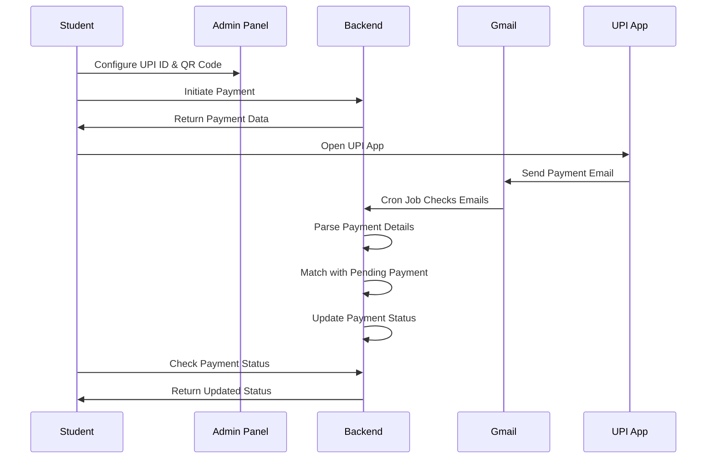

# UPI Payment System for School Management

A complete fee payment system that allows students to pay fees using UPI without integrating traditional payment gateways. The system uses email parsing to automatically verify payments.

## 🚀 Features

- **UPI Payment Integration**: Students can pay fees using any UPI app
- **QR Code Support**: Display QR codes for easy payment scanning
- **Auto-Verification**: Automatically verify payments via Gmail email parsing
- **Real-time Status Updates**: Live payment status tracking
- **Admin Panel**: Complete payment settings management
- **Mobile App Integration**: Seamless React Native integration

## 🏗️ Architecture

### Backend (Node.js + Express + MongoDB)
- **Models**: PaymentSettings, FeePayment, PaymentLog
- **Controllers**: Payment settings, fee payments, verification
- **Services**: Gmail OAuth, email parsing
- **Cron Jobs**: Auto-verification every 2 minutes

### Frontend
- **Admin Panel**: React.js + TailwindCSS
- **Mobile App**: React Native

## 📋 Prerequisites

### Environment Variables
Add these to your `.env` file:

```env
# Gmail OAuth Configuration
GOOGLE_CLIENT_ID=your_google_client_id
GOOGLE_CLIENT_SECRET=your_google_client_secret
GOOGLE_REDIRECT_URI=http://localhost:5000/api/payment-system/oauth/callback

# Encryption Key for sensitive data
ENCRYPTION_KEY=your_encryption_key

# Existing MongoDB and other configurations
MONGODB_URI=your_mongodb_uri
```

### Google Cloud Console Setup
1. Go to [Google Cloud Console](https://console.cloud.google.com/)
2. Create a new project or select existing one
3. Enable Gmail API
4. Create OAuth 2.0 credentials
5. Add authorized redirect URIs
6. Download credentials and add to environment variables

## 🛠️ Installation

### Backend Dependencies
```bash
cd vidyaastraaws
npm install googleapis node-cron crypto
```

### Frontend Dependencies
```bash
# Admin Panel
cd SchoolManagementAdmin
npm install

# Mobile App
cd SchoolManagement
npm install
```

## 📱 Usage

### 1. Admin Panel Setup

1. **Login to Admin Panel**
   - Navigate to `/payment-settings`
   - Configure UPI ID and upload QR code

2. **Gmail Integration**
   - Click "Connect Gmail" button
   - Authorize Gmail access for email parsing
   - System will automatically verify payments

### 2. Student Payment Flow

1. **Student opens Fees screen**
2. **Clicks "Pay Now" on pending installment**
3. **Payment screen opens with:**
   - QR code for scanning
   - UPI ID for manual entry
   - "Open UPI App to Pay" button
4. **Student completes payment in UPI app**
5. **System automatically verifies payment via email**
6. **Status updates to "Paid" within 2 minutes**

## 🔧 API Endpoints

### Payment Settings
- `POST /api/payment-system/settings` - Create/update payment settings
- `GET /api/payment-system/settings` - Get payment settings
- `PUT /api/payment-system/settings/gmail` - Update Gmail credentials
- `DELETE /api/payment-system/settings` - Delete payment settings

### Fee Payments
- `POST /api/payment-system/fees/initiate` - Initiate fee payment
- `GET /api/payment-system/fees/student` - Get student payments
- `GET /api/payment-system/fees/status/:paymentId` - Get payment status
- `PUT /api/payment-system/fees/status/:paymentId` - Update payment status
- `GET /api/payment-system/fees/pending` - Get pending payments

### Payment Verification
- `POST /api/payment-system/verify` - Process payment verification
- `GET /api/payment-system/logs` - Get payment logs
- `POST /api/payment-system/verify/manual` - Trigger manual verification
- `GET /api/payment-system/statistics` - Get payment statistics

### Gmail OAuth
- `GET /api/payment-system/oauth/url` - Get OAuth URL
- `GET /api/payment-system/oauth/callback` - OAuth callback

## 📊 Database Schema

### PaymentSettings
```javascript
{
  schoolId: ObjectId,
  upiId: String,
  qrCodeUrl: String,
  isActive: Boolean,
  gmailCredentials: {
    accessToken: String,
    refreshToken: String,
    tokenExpiry: Date,
    email: String
  }
}
```

### FeePayment
```javascript
{
  studentId: ObjectId,
  schoolId: ObjectId,
  feeId: ObjectId,
  installmentIndex: Number,
  amount: Number,
  status: String, // "pending" | "paid" | "failed"
  transactionId: String,
  paymentMethod: String,
  paidDate: Date,
  paymentAttempts: Array
}
```

### PaymentLog
```javascript
{
  schoolId: ObjectId,
  rawEmailData: String,
  transactionId: String,
  amount: Number,
  payerUpi: String,
  matchedFeeId: ObjectId,
  status: String, // "matched" | "unmatched" | "processing"
  emailSubject: String,
  emailFrom: String,
  emailDate: Date
}
```

## 🔄 Payment Flow



## 🧪 Testing

Run the test suite:
```bash
cd vidyaastraaws
node test-payment-system.js
```

### Manual Testing Steps

1. **Setup Payment Settings**
   ```bash
   curl -X POST http://localhost:5000/api/payment-system/settings \
     -H "Content-Type: multipart/form-data" \
     -F "schoolId=your_school_id" \
     -F "upiId=your_upi_id" \
     -F "qrCode=@qr_code.png"
   ```

2. **Initiate Payment**
   ```bash
   curl -X POST http://localhost:5000/api/payment-system/fees/initiate \
     -H "Content-Type: application/json" \
     -d '{
       "studentId": "student_id",
       "schoolId": "school_id", 
       "feeId": "fee_id",
       "installmentIndex": 0,
       "amount": 1000
     }'
   ```

3. **Test Payment Verification**
   ```bash
   curl -X POST http://localhost:5000/api/payment-system/verify \
     -H "Content-Type: application/json" \
     -d '{
       "schoolId": "school_id",
       "transactionId": "TXN123456",
       "amount": 1000,
       "payerUpi": "student@paytm"
     }'
   ```

## 🔒 Security Features

- **Token Encryption**: Gmail credentials are encrypted before storage
- **JWT Authentication**: All API endpoints require authentication
- **Input Validation**: All inputs are validated and sanitized
- **Rate Limiting**: API endpoints have rate limiting
- **Secure OAuth**: Gmail OAuth follows security best practices

## 🚨 Troubleshooting

### Common Issues

1. **Gmail OAuth Not Working**
   - Check Google Cloud Console configuration
   - Verify redirect URI matches exactly
   - Ensure Gmail API is enabled

2. **Payment Not Verified**
   - Check Gmail credentials are valid
   - Verify cron job is running
   - Check email parsing patterns

3. **QR Code Not Displaying**
   - Verify file upload path
   - Check file permissions
   - Ensure image format is supported

### Debug Mode

Enable debug logging:
```javascript
// In server.js
process.env.DEBUG = 'payment-system:*';
```

## 📈 Monitoring

### Health Check
```bash
curl http://localhost:5000/api/payment-system/statistics?schoolId=your_school_id
```

### Cron Job Status
Check server logs for cron job execution:
```
🔄 Starting payment verification cycle...
📧 Found 1 schools with Gmail configured
✅ School school_id: 2 processed, 1 matched
```

## 🔄 Updates & Maintenance

### Updating Gmail Credentials
- Tokens expire automatically
- System refreshes tokens using refresh token
- Manual refresh available in admin panel

### Adding New UPI Providers
- Update email parsing patterns in `emailParsingService.js`
- Add provider detection logic
- Test with sample emails

## 📞 Support

For issues or questions:
1. Check the troubleshooting section
2. Review server logs
3. Run the test suite
4. Contact development team

## 🎯 Future Enhancements

- [ ] SMS parsing support
- [ ] Multiple UPI ID support
- [ ] Payment analytics dashboard
- [ ] Automated receipt generation
- [ ] Integration with more UPI apps
- [ ] Payment reminders
- [ ] Bulk payment processing

---

**Note**: This system is designed to work without traditional payment gateways. It relies on UPI apps and email parsing for verification. Ensure proper Gmail setup and UPI ID configuration for optimal functionality.

